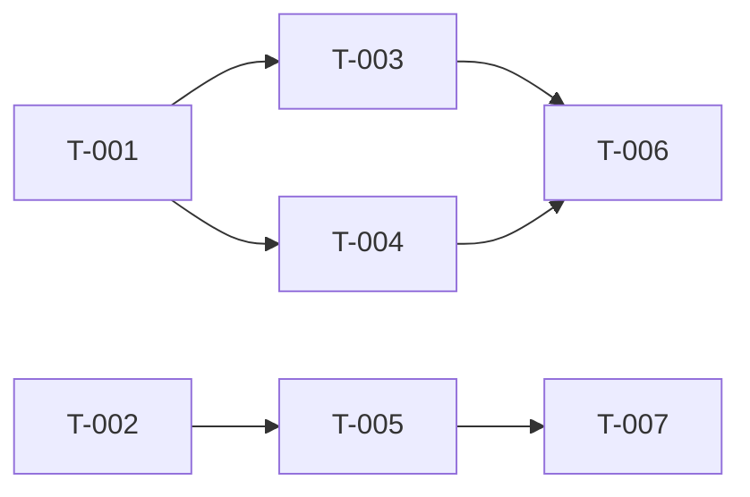

**What this does:** Reads your kits and generates a build site — a dependency-ordered task graph that tells the builder what to build and in what order. No domain plans, no file ownership: just tasks, requirement mappings, and blockers.
**When to use it:** Right after `/ck:sketch`. If multiple kits exist, use `--filter PATTERN` to scope.

# Cavekit Map — Generate Build Site

This is the second phase of Cavekit. You read kits and generate a build site — a dependency-ordered task graph that tells the builder what to build and in what order.

No domain plans. No file ownership. No time budgets. Just: tasks, what cavekit requirement they implement, and what blocks what.

## Step 0: Resolve Execution Profile

Before generating the site:

1. Run `"${CLAUDE_PLUGIN_ROOT}/scripts/bp-config.sh" summary` and print that exact line once.
2. Run `"${CLAUDE_PLUGIN_ROOT}/scripts/bp-config.sh" model reasoning` and treat the result as `REASONING_MODEL`.
3. Run `"${CLAUDE_PLUGIN_ROOT}/scripts/bp-config.sh" caveman-active architect` and treat the result as `CAVEMAN_ACTIVE` (true/false). Architect phase is NOT in the default caveman_phases, so this will typically be false. If true, apply caveman-speak to status updates and architect subagent reasoning only — never to build site content (task titles, descriptions, coverage matrix).

Do NOT rely on the agent frontmatter model. Dispatch the actual site-generation work to a `ck:map` subagent with `model: "{REASONING_MODEL}"`.

## Step 1: Validate Kits Exist

Check `context/kits/` for cavekit files. If none found, tell the user:
> No kits found. Run `/ck:sketch` first.

If `--filter` is set, only include kits matching the filter pattern.

## Step 2: Read All Kits

1. Read `context/kits/cavekit-overview.md` if it exists (for dependency graph)
2. Read all `context/kits/cavekit-*.md` files (apply filter if set)
3. Catalog every requirement (R-numbered) with its acceptance criteria and dependencies
4. If `DESIGN.md` exists at project root, read it — note all design tokens and component patterns for use when decomposing UI requirements into tasks

## Step 3: Decompose Requirements into Tasks

Break each requirement into one or more implementable tasks:
- Simple requirements (1-2 acceptance criteria) → 1 task
- Complex requirements (3+ acceptance criteria, multiple concerns) → multiple tasks
- Each task should be completable in one loop iteration
- When decomposing, cross-check EACH acceptance criterion in the requirement — ensure at least one task will validate it. A single task covering "R1" is insufficient if R1 has 6 acceptance criteria and the task only addresses 2 of them.
- For UI tasks: include `**Design Ref:** DESIGN.md Section {N} — {section name}` in the task description to guide the builder on which design patterns apply

Use T-numbered task IDs (T-001, T-002, ...) across all domains.

## Step 4: Build Dependency Graph

For each task, determine what it's blocked by:
- Explicit dependencies from cavekit (R2 depends on R1)
- Implicit dependencies (can't test an API endpoint before the data model exists)
- Cross-domain dependencies (notifications depend on the events they notify about)

Organize tasks into tiers:
- **Tier 0**: tasks with no dependencies (start here)
- **Tier 1**: tasks that depend only on Tier 0 tasks
- **Tier 2**: tasks that depend on Tier 0 or Tier 1 tasks
- etc.

## Step 5: Write the Site

Create the `context/plans/` directory if it doesn't exist.

Dispatch a `ck:map` subagent with `model: "{REASONING_MODEL}"` to produce the build-site contents from the kits and dependencies you cataloged above, then write the returned site to disk.

Write `context/plans/build-site.md`:

```markdown
---
created: "{CURRENT_DATE_UTC}"
last_edited: "{CURRENT_DATE_UTC}"
---

# Build Site

{Total tasks} tasks across {total tiers} tiers from {cavekit count} kits.

---

## Tier 0 — No Dependencies (Start Here)

| Task | Title | Cavekit | Requirement | Effort |
|------|-------|------|------------|--------|
| T-001 | {title} | cavekit-{domain}.md | R1 | {S/M/L} |
| T-002 | {title} | cavekit-{domain}.md | R1 | {S/M/L} |

---

## Tier 1 — Depends on Tier 0

| Task | Title | Cavekit | Requirement | blockedBy | Effort |
|------|-------|------|------------|-----------|--------|
| T-003 | {title} | cavekit-{domain}.md | R2 | T-001 | {S/M/L} |

---

## Tier 2 — Depends on Tier 1
...

---

## Summary

| Tier | Tasks | Effort |
|------|-------|--------|
| 0 | {n} | {breakdown} |
| 1 | {n} | {breakdown} |
| ... | | |

**Total: {n} tasks, {n} tiers**

## Coverage Matrix

Every acceptance criterion from every cavekit requirement MUST appear below with its assigned task(s). If any criterion has no task, the site is incomplete.

| Cavekit | Req | Criterion | Task(s) | Status |
|-----------|-----|-----------|---------|--------|
| cavekit-{domain}.md | R1 | {criterion text, abbreviated} | T-001 | COVERED |
| cavekit-{domain}.md | R1 | {criterion text, abbreviated} | T-001, T-002 | COVERED |
| cavekit-{domain}.md | R2 | {criterion text, abbreviated} | T-003 | COVERED |
| cavekit-{domain}.md | R2 | {criterion text, abbreviated} | — | GAP |

**Coverage: {covered}/{total} criteria ({percentage}%)**

If any row shows GAP, add tasks to cover it before proceeding.
```

If a site already exists, ask the user whether to overwrite or keep the existing one.

## Step 6: Dependency Graph

After the tier tables, add a **directed parallelization graph** using Mermaid syntax. This shows at a glance which tasks can run in parallel and what blocks what:

```markdown
## Dependency Graph


```

Rules for the graph:
- Every task appears as a node
- Arrows point from dependency → dependent (A --> B means "A must finish before B starts")
- Tasks with NO incoming arrows can run immediately (Tier 0)
- Tasks at the same depth with no edges between them can run in parallel
- Use `graph LR` (left-to-right) for readability
- Group by tier visually where possible

## Step 6.5: Populate the runtime task registry (when `.cavekit/` exists)

If `.cavekit/` is present (user ran `/ck:init`), also emit a flat JSON task
list so the autonomous runtime can route through the build wave-by-wave:

1. Assemble a flat JSON array, one entry per task:

   ```json
   [
     {"id":"T-001","title":"…","tier":1,"depends_on":[],"depth":"standard",
      "kit":"cavekit-auth.md","requirement_ids":["R001","R002"]}
   ]
   ```

   `depth` for each task comes from the kit's `complexity` field (populated by
   `/ck:sketch`'s post-draft classifier), or from an on-demand dispatch to
   the `ck:complexity` subagent when missing. Map
   `quick` → `quick`, `medium` → `standard`, `complex` → `thorough`.

2. Write the array to `.cavekit/tasks.json`.

3. Initialize the task registry:

   ```bash
   node "${CLAUDE_PLUGIN_ROOT}/scripts/cavekit-tools.cjs" init-registry \
     --from .cavekit/tasks.json
   ```

   This writes `.cavekit/task-status.json` in the registry schema
   (`pending | implementing | complete | blocked`), which the stop-hook
   reads to compute the frontier.

4. For tasks whose kit carries a `<!-- cavekit: needs_research -->`
   annotation (from `/ck:sketch`), prepend a research task:
   - id: `T-0{n}-research`
   - depends_on: `[]`
   - depth: `standard`
   - Add the research task id to the main task's `depends_on`

   When `/ck:make` hits such a task, it dispatches the `ck:researcher`
   agent instead of `ck:task-builder`, stores the brief to
   `context/refs/research-{topic}.md`, and marks the research task complete.

5. Record the recommended model tier per task for the runtime to consult:

   ```bash
   for t in $(jq -r '.[].id' .cavekit/tasks.json); do
     files=$(jq -r --arg id "$t" '.[] | select(.id==$id) | (.requirement_ids|length)' .cavekit/tasks.json)
     depth=$(jq -r --arg id "$t" '.[] | select(.id==$id) | .depth' .cavekit/tasks.json)
     # score heuristic: files = requirement_ids count, type=feature, depth maps to judgment
     node "${CLAUDE_PLUGIN_ROOT}/scripts/cavekit-router.cjs" classify-task \
       --role ck:task-builder \
       --files "$files" \
       --type feature \
       --judgment medium \
       --cross-component 0 \
       --novelty known
   done
   ```

   (Recording the chosen tier per task in the registry is a future
   enhancement; today the router is consulted at wave dispatch time.)

## Step 7: Report

```markdown
## Architect Report

### Kits Read: {count}
### Tasks Generated: {count}
### Tiers: {count}
### Tier 0 Tasks: {count} (can run in parallel immediately)
### Runtime registry: {initialized / skipped — no .cavekit/}

### Next Step
Run `/ck:make` to start implementation (auto-parallelizes independent tasks).
Run `/ck:make --peer-review` to add Codex review.
```

### Rules

- Every cavekit requirement MUST map to at least one task
- Every ACCEPTANCE CRITERION within every requirement MUST map to at least one task — requirement-level coverage is not sufficient. A requirement with 5 acceptance criteria needs tasks that collectively cover all 5, not just 1.
- The Coverage Matrix in the build site must show 100% COVERED status. If any row shows GAP, add tasks before finishing.
- Tasks should be small — prefer M over XL
- Dependencies must be genuine blockers, not just ordering preferences
- The site is the ONLY planning artifact — no domain plans, no file ownership
- Update `last_edited` if modifying an existing site
