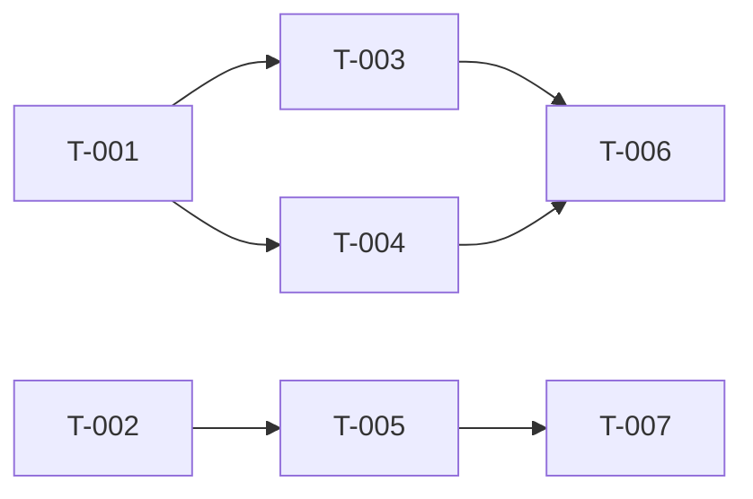

> **Note:** `/bp:architect`, `/ck:architect`, `/bp:map` are deprecated aliases. Use `/ck:map` instead.

# Cavekit Architect — Generate Build Site

This is the second phase of Cavekit. You read kits and generate a build site — a dependency-ordered task graph that tells the builder what to build and in what order.

No domain plans. No file ownership. No time budgets. Just: tasks, what cavekit requirement they implement, and what blocks what.

## Workspace root resolution

Before any substantive work, attempt to resolve the **workspace root**:

1. Start from the current working directory.
2. Walk upward through parent directories until you find one that contains all of these markers:
   - A `sanetics-wiki/` directory
   - A `setup.sh` file
   - A `.claude/` directory
3. If such an ancestor is found, remember its absolute path as `WORKSPACE_ROOT`. From the workspace root the wiki directory lives at `<WORKSPACE_ROOT>/sanetics-wiki/` and each sub-repo is a sibling (for example `<WORKSPACE_ROOT>/saneticscode/`, `<WORKSPACE_ROOT>/saniloop-aggregate/saniloop/`, `<WORKSPACE_ROOT>/claude-code/cavekit/`).
4. If no ancestor contains all three markers, `WORKSPACE_ROOT` is **unset** — the command was invoked outside a sanetics-workspace. Fall back to plain CWD behavior (no workspace-aware features).

Do not use environment variables or hardcoded absolute paths for workspace resolution. The workspace root is always discovered dynamically from the current working directory.

## Context selection

If `WORKSPACE_ROOT` is set, determine the **target sub-repo** before Step 0:

1. **Detect invocation location:** compare CWD to `WORKSPACE_ROOT`.
   - If CWD is inside a sub-repo (CWD is a descendant of `WORKSPACE_ROOT`), the enclosing sub-repo is the target automatically — do not prompt.
   - If CWD equals `WORKSPACE_ROOT`, you are at the workspace level (handled in step 2).
2. **Workspace-root invocation:** when CWD is the workspace root, check whether a target sub-repo was passed as an argument.
   - If a sub-repo name was passed (e.g. `saneticscode`, `saniloop-aggregate/saniloop`), resolve it as `<WORKSPACE_ROOT>/<name>` and use it as the target.
   - If no sub-repo argument was passed, list the sibling sub-repos under `WORKSPACE_ROOT` and prompt the user to pick one.
   - After selection, operate as if invoked from within the chosen sub-repo — read its codebase and read/write its `context/` directory.
3. **Cross-reference another sub-repo:** accept an optional reference to another sub-repo whose context should also be read. The reference is given by directory name relative to `WORKSPACE_ROOT`. When provided, resolve it as `<WORKSPACE_ROOT>/<reference>` and read `context/kits/`, `context/plans/`, `context/impl/` from **both** the target sub-repo and the referenced sub-repo.

If `WORKSPACE_ROOT` is unset, skip this section: the target is simply the CWD.

## Step 0: Resolve Execution Profile

Before generating the site:

1. Run `"${CLAUDE_PLUGIN_ROOT}/scripts/bp-config.sh" summary` and print that exact line once.
2. Run `"${CLAUDE_PLUGIN_ROOT}/scripts/bp-config.sh" model reasoning` and treat the result as `REASONING_MODEL`.
3. Run `"${CLAUDE_PLUGIN_ROOT}/scripts/bp-config.sh" caveman-active architect` and treat the result as `CAVEMAN_ACTIVE` (true/false). Architect phase is NOT in the default caveman_phases, so this will typically be false. If true, apply caveman-speak to status updates and architect subagent reasoning only — never to build site content (task titles, descriptions, coverage matrix).

Do NOT rely on the agent frontmatter model. Dispatch the actual site-generation work to a `ck:map` subagent with `model: "{REASONING_MODEL}"`.

## Step 0b: Wiki Routing

Parse `$ARGUMENTS` for the `--wiki` flag.

- **If `--wiki` is NOT present** → **local mode**. Use `context/` paths under the target sub-repo (or CWD if `WORKSPACE_ROOT` is unset). Do not read any wiki routing document.
- **If `--wiki` IS present** → read and follow the wiki routing document. Do not inline any routing procedure details here — the document is the source of truth for project discovery, PR sync, Grav front matter, and auto-commit.
  - If `WORKSPACE_ROOT` is set, prefer `<WORKSPACE_ROOT>/.claude/wiki-routing.md` (accessible from any sub-repo via the `.claude` symlink as `.claude/wiki-routing.md`).
  - Otherwise, fall back to `"${CLAUDE_PLUGIN_ROOT}/references/wiki-routing.md"`.

Resolve paths: kits at `<wiki-project>/10.kits/` (wiki) or `context/kits/` (local), build site at `<wiki-project>/11.build-site/` (wiki) or `context/plans/` (local).

## Step 1: Validate Kits Exist

Check the resolved kits path for cavekit files. If none found, tell the user:
> No kits found. Run `/ck:sketch` first.

If `--filter` is set, only include kits matching the filter pattern.

## Step 2: Read All Kits

1. Read `cavekit-overview.md` from the resolved kits path if it exists (for dependency graph)
2. Read all `cavekit-*.md` files from the resolved kits path (apply filter if set)
3. Catalog every requirement (R-numbered) with its acceptance criteria and dependencies
4. If `DESIGN.md` exists at project root, read it — note all design tokens and component patterns for use when decomposing UI requirements into tasks

## Step 3: Decompose Requirements into Tasks

Break each requirement into one or more implementable tasks:
- Simple requirements (1-2 acceptance criteria) → 1 task
- Complex requirements (3+ acceptance criteria, multiple concerns) → multiple tasks
- Each task should be completable in one loop iteration
- When decomposing, cross-check EACH acceptance criterion in the requirement — ensure at least one task will validate it. A single task covering "R1" is insufficient if R1 has 6 acceptance criteria and the task only addresses 2 of them.
- For UI tasks: include `**Design Ref:** DESIGN.md Section {N} — {section name}` in the task description to guide the builder on which design patterns apply

Use T-numbered task IDs (T-001, T-002, ...) across all domains.

## Step 4: Build Dependency Graph

For each task, determine what it's blocked by:
- Explicit dependencies from cavekit (R2 depends on R1)
- Implicit dependencies (can't test an API endpoint before the data model exists)
- Cross-domain dependencies (notifications depend on the events they notify about)

Organize tasks into tiers:
- **Tier 0**: tasks with no dependencies (start here)
- **Tier 1**: tasks that depend only on Tier 0 tasks
- **Tier 2**: tasks that depend on Tier 0 or Tier 1 tasks
- etc.

## Step 5: Write the Site

Create the output directory if it doesn't exist:
- **Wiki mode:** `<wiki-project>/11.build-site/` (with `chapter.md` if missing — see wiki routing reference section 9)
- **Local mode:** `context/plans/`

Dispatch a `ck:map` subagent with `model: "{REASONING_MODEL}"` to produce the build-site contents from the kits and dependencies you cataloged above, then write the returned site to disk.

Write the build site to the resolved path (`<wiki-project>/11.build-site/build-site.md` or `context/plans/build-site.md`):

```markdown
---
created: "{CURRENT_DATE_UTC}"
last_edited: "{CURRENT_DATE_UTC}"
---

# Build Site

{Total tasks} tasks across {total tiers} tiers from {cavekit count} kits.

---

## Tier 0 — No Dependencies (Start Here)

| Task | Title | Cavekit | Requirement | Effort |
|------|-------|------|------------|--------|
| T-001 | {title} | cavekit-{domain}.md | R1 | {S/M/L} |
| T-002 | {title} | cavekit-{domain}.md | R1 | {S/M/L} |

---

## Tier 1 — Depends on Tier 0

| Task | Title | Cavekit | Requirement | blockedBy | Effort |
|------|-------|------|------------|-----------|--------|
| T-003 | {title} | cavekit-{domain}.md | R2 | T-001 | {S/M/L} |

---

## Tier 2 — Depends on Tier 1
...

---

## Summary

| Tier | Tasks | Effort |
|------|-------|--------|
| 0 | {n} | {breakdown} |
| 1 | {n} | {breakdown} |
| ... | | |

**Total: {n} tasks, {n} tiers**

## Coverage Matrix

Every acceptance criterion from every cavekit requirement MUST appear below with its assigned task(s). If any criterion has no task, the site is incomplete.

| Cavekit | Req | Criterion | Task(s) | Status |
|-----------|-----|-----------|---------|--------|
| cavekit-{domain}.md | R1 | {criterion text, abbreviated} | T-001 | COVERED |
| cavekit-{domain}.md | R1 | {criterion text, abbreviated} | T-001, T-002 | COVERED |
| cavekit-{domain}.md | R2 | {criterion text, abbreviated} | T-003 | COVERED |
| cavekit-{domain}.md | R2 | {criterion text, abbreviated} | — | GAP |

**Coverage: {covered}/{total} criteria ({percentage}%)**

If any row shows GAP, add tasks to cover it before proceeding.
```

If a site already exists, ask the user whether to overwrite or keep the existing one.

## Step 6: Dependency Graph

After the tier tables, add a **directed parallelization graph** using Mermaid syntax. This shows at a glance which tasks can run in parallel and what blocks what:

```markdown
## Dependency Graph


```

Rules for the graph:
- Every task appears as a node
- Arrows point from dependency → dependent (A --> B means "A must finish before B starts")
- Tasks with NO incoming arrows can run immediately (Tier 0)
- Tasks at the same depth with no edges between them can run in parallel
- Use `graph LR` (left-to-right) for readability
- Group by tier visually where possible

## Step 7: Report

```markdown
## Architect Report

### Kits Read: {count}
### Tasks Generated: {count}
### Tiers: {count}
### Tier 0 Tasks: {count} (can run in parallel immediately)

### Next Step
Run `/ck:make` to start implementation (auto-parallelizes independent tasks).
Run `/ck:make --peer-review` to add Codex review.
```

### Auto-Commit (wiki mode only)

After writing the build site, follow the auto-commit procedure in wiki routing reference section 5. Stage the `11.build-site/` folder (and `chapter.md` if a new project was created).

### Rules

- Every cavekit requirement MUST map to at least one task
- Every ACCEPTANCE CRITERION within every requirement MUST map to at least one task — requirement-level coverage is not sufficient. A requirement with 5 acceptance criteria needs tasks that collectively cover all 5, not just 1.
- The Coverage Matrix in the build site must show 100% COVERED status. If any row shows GAP, add tasks before finishing.
- Tasks should be small — prefer M over XL
- Dependencies must be genuine blockers, not just ordering preferences
- The site is the ONLY planning artifact — no domain plans, no file ownership
- Update `last_edited` if modifying an existing site
