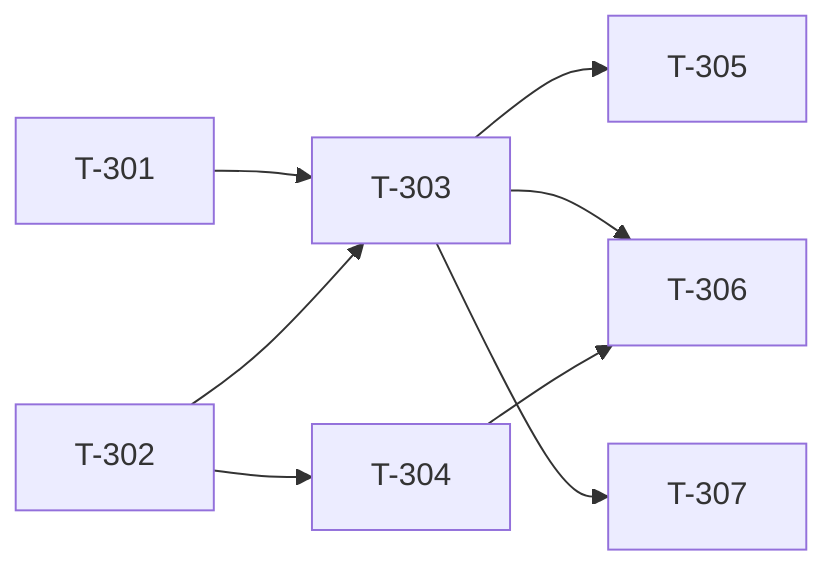

# Build Site — Dual-Model Cavekit Drafting (Design Challenge)

7 tasks across 3 tiers from 1 cavekit (+ codex-bridge dependency).

---

## Tier 0 — No Dependencies (Start Here)

| Task | Title | Cavekit | Requirement | Effort |
|------|-------|-----------|-------------|--------|
| T-301 | Design challenge prompt template (domain decomposition, coverage, ambiguity focus) | cavekit-draft-challenge.md | R5 | M |
| T-302 | Challenge output parser (categorized findings with severity) | cavekit-draft-challenge.md | R2 | M |

---

## Tier 1 — Depends on Tier 0

| Task | Title | Cavekit | Requirement | blockedBy | Effort |
|------|-------|-----------|-------------|-----------|--------|
| T-303 | Codex design challenge invocation (send all kits + overview, receive findings) | cavekit-draft-challenge.md | R1 | T-301, T-302 | M |
| T-304 | Advisory findings collector and user-facing presentation format | cavekit-draft-challenge.md | R2 | T-302 | S |

---

## Tier 2 — Depends on Tier 1

| Task | Title | Cavekit | Requirement | blockedBy | Effort |
|------|-------|-----------|-------------|-----------|--------|
| T-305 | Auto-fix loop — Claude addresses critical findings, re-challenges (max 2 cycles) | cavekit-draft-challenge.md | R3 | T-303 | L |
| T-306 | Draft flow integration — insert between cavekit-reviewer and user review gate | cavekit-draft-challenge.md | R4 | T-303, T-304 | M |
| T-307 | Graceful degradation — skip challenge when Codex unavailable, log timing | cavekit-draft-challenge.md | R4 | T-303 | S |

---

## Dependency Graph

---

## Summary

| Tier | Tasks | Effort |
|------|-------|--------|
| 0 | 2 | 2M |
| 1 | 2 | 1M + 1S |
| 2 | 3 | 1L + 1M + 1S |

**Total: 7 tasks, 3 tiers**

---

## Cross-Site Dependencies

Requires from `build-site-codex.md`:
- T-001, T-002 (Codex detection) — needed before T-303 can invoke
- T-006 (Codex invocation mechanism) — the challenge uses the same Codex communication path

**Build order:** Execute `build-site-codex` through Tier 1 before starting this site's Tier 1. Tier 0 tasks here are independent and can run in parallel with `build-site-codex` Tier 0.

---

## Architect Report

### Kits Read: 1 (+ codex-bridge for shared infrastructure)
### Tasks Generated: 7
### Tiers: 3
### Tier 0 Tasks: 2 (can run in parallel immediately)

### Task-to-Requirement Coverage
| Cavekit | Requirement | Tasks |
|-----------|-------------|-------|
| draft-challenge | R1 (Design Challenge Invocation) | T-303 |
| draft-challenge | R2 (Challenge Output Format) | T-302, T-304 |
| draft-challenge | R3 (Auto-Fix Loop) | T-305 |
| draft-challenge | R4 (Draft Flow Integration) | T-306, T-307 |
| draft-challenge | R5 (Challenge Prompt Design) | T-301 |

### Next Step
Run `/bp:build` after `build-site-codex` Tier 1 is complete.
