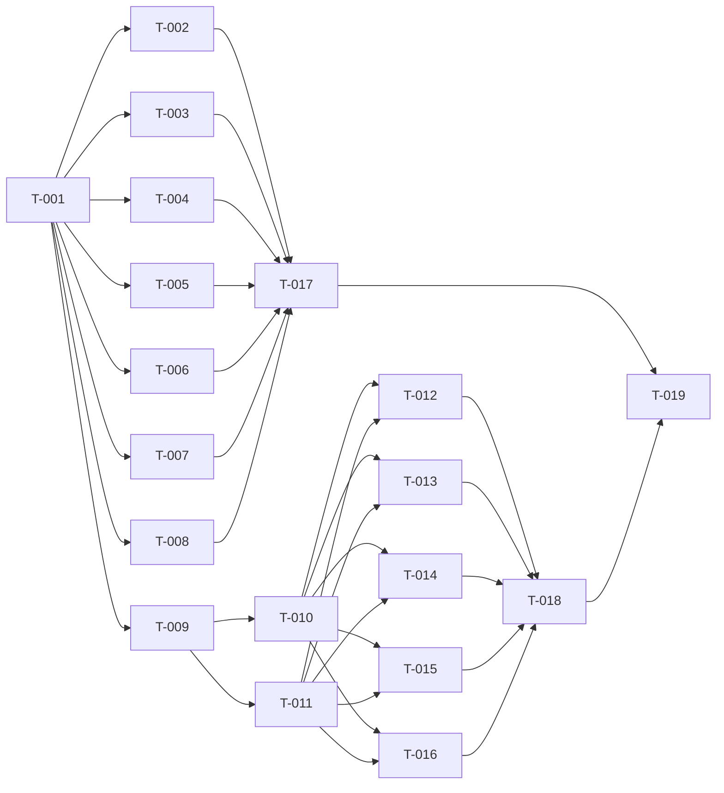

# Build Site

19 tasks across 5 tiers from 2 kits.

**Skill Instructions:** All implementation subagents MUST invoke the following skills before writing any code:
- `emil-design-eng` — animation decisions, easing curves, component polish
- `make-interfaces-feel-better` — typography, surfaces, stagger animations, press feedback
- `ui-ux-pro-max` — accessibility, touch targets, contrast, responsive rules
- `frontend-design` — bold aesthetic direction, distinctive font choices, visual composition

**Implementation context:** Both files deploy to the `gh-pages` branch. Each task works on either `index.html` (landing page) or `docs.html` (docs page). The current site exists at `juliusbrussee.github.io/cavekit/` — the current `index.html` is in the `gh-pages` branch for reference. All content derives from the existing README.md and skill files in the repo.

---

## Tier 0 — No Dependencies (Start Here)

| Task | Title | Cavekit | Requirement | Effort |
|------|-------|-----------|-------------|--------|
| T-001 | Landing page foundation: scaffold + design system + animation infra | cavekit-landing-page.md | R1, R10, R11, R12, R13 (partial) | L |

**T-001 details:** Create the `index.html` skeleton with:
- Full CSS design system: custom properties (colors, fonts, glassmorphism tokens), near-black background with noise texture + faint grid, display font loading via Google Fonts with `font-display: swap` and `<link rel="preload">`, monospace + sans-serif fallbacks, `-webkit-font-smoothing: antialiased`
- Base reset, responsive breakpoints (mobile <768px, desktop >=768px), `viewport` meta tag
- Animation infrastructure: `.section` → `.visible` IntersectionObserver, CSS animation utility classes (`.animate-fade`, stagger delays), custom `ease-out` curve `cubic-bezier(0.23, 1, 0.32, 1)`, `@media (prefers-reduced-motion: reduce)` disabling all motion
- Semantic HTML shell: `<!DOCTYPE html>`, `<head>` with meta/OG tags, `<body>` with empty `<section>` placeholders for all 8 sections, `<footer>`
- Skip-to-content link, heading hierarchy started (h1 in hero, h2 for sections)
- All CSS inline in `<style>`, all JS inline in `<script>`

---

## Tier 1 — Depends on Tier 0

| Task | Title | Cavekit | Requirement | blockedBy | Effort |
|------|-------|-----------|-------------|-----------|--------|
| T-002 | Hero section: title, pipeline SVG, particle, install block | cavekit-landing-page.md | R2 | T-001 | L |
| T-003 | Problem section: 4 diagnostic cards with severity bars | cavekit-landing-page.md | R3 | T-001 | M |
| T-004 | How It Works: 4 Hunt phase cards with glow connections | cavekit-landing-page.md | R4 | T-001 | M |
| T-005 | Dual-Model Advantage: 3 review cards with mini diagrams | cavekit-landing-page.md | R5 | T-001 | L |
| T-006 | Ralph Loop: elliptical SVG, orbiting particle, metrics | cavekit-landing-page.md | R6 | T-001 | L |
| T-007 | Parallel Execution: wave visualization with task cards | cavekit-landing-page.md | R7 | T-001 | M |
| T-008 | Get Started + Footer: terminal, typewriter, CTAs, footer | cavekit-landing-page.md | R8, R9 | T-001 | M |
| T-009 | Docs page foundation: shared identity, layout, top bar | cavekit-docs-page.md | R1, R2, R3, R13, R14, R15, R16 (partial) | T-001 | L |

**T-002 details:** Full hero section — 100vh centered layout. Version badge pill. "Cavekit" title in display font at ~72px with glow text-shadow. Subtitle. Hunt pipeline SVG: boxes (YOU, DRAFT, ARCHITECT, AGENT 1/2/3, MERGE) with glassmorphism fills, dashed connecting paths, glowing particle tracing the full pipeline via `<animateMotion>` with `drop-shadow` filter. Install terminal block with glassmorphism surface, two commands in monospace, copy button that morphs "COPY" → "COPIED ✓" with green flash (reverts after 2s). Two links: "View on GitHub →", "Read the Docs →". Staggered load animation: badge → title → subtitle → pipeline → install → links (50-100ms delays). Copy button has `scale(0.97)` on `:active`.

**T-003 details:** "THE PROBLEM" section. Headline: "AI coding agents are powerful. They fail in predictable ways." 2×2 card grid (1-col mobile). Cards: glassmorphism + red-tinted border, neon-red monospace title with glow, description, severity bar (fills 70-90% on scroll, `ease-out` 800ms). Stagger: 80ms between cards, `translateY(12px)` entrance.

**T-004 details:** "HOW IT WORKS" section. 4 horizontal cards (vertical mobile): Draft, Architect, Build, Inspect. Large phase letter (48px, blue glow), name, `/ck:*` command pill, one-liner. Connected by animated glow lines with traveling pulse. Paragraph below about kits as source of truth. Stagger: 100ms between cards.

**T-005 details:** "ADVERSARIAL REVIEW" section. Headline + subheadline. 3 stacked full-width cards: Design Challenge (PRE-BUILD badge, Claude→Reviewer→Codex→User flow diagram), Tier Gate (BUILD-TIME badge, P0-P3 severity table with colored dots), Command Safety (RUNTIME badge, command→fast-path→classify→verdict flow). Glassmorphism cards with colored badges. Note about additive features. Stagger: 100ms. Mini diagrams draw after card visible (+300ms).

**T-006 details:** "THE BUILD LOOP" section. Glassmorphism panel with scanline overlay. Elliptical SVG loop, 5 nodes (READ, IMPLEMENT, VALIDATE, COMMIT, NEXT TASK). Glowing particle orbits continuously via `<animateMotion>` + `drop-shadow`. FAIL branch in red from VALIDATE. COMMIT pulses green on particle pass. Metrics readout bar: Iterations (animated 1→18 counter, loops 3s), Tasks (34), Pass Rate (100%), Status (COMPLETE). Path draws on scroll (stroke-dashoffset, 2s).

**T-007 details:** "PARALLEL EXECUTION" section. Wave visualization: Wave 1 = 3 task cards (T-001 Schema/Agent A, T-002 Auth/Agent A, T-003 Config/Agent B), dependency arrows, Wave 2 = 2 task cards (T-004 Users/Agent A, T-005 Health/Agent B). Glassmorphism cards, monospace content. Wave 1 staggers (80ms), pause 400ms, arrows draw, Wave 2 staggers. "BUILD COMPLETE" badge fades in with green glow. Note about circuit breakers.

**T-008 details:** "GET STARTED" section + footer. Headline: "Two commands. You're building from kits." Large glassmorphism terminal (max-width ~700px) with fake chrome (3 dots + title). Typewriter animation (~40ms/char + jitter) for both commands. Blinking cursor. Copy button: "COPY" → "COPIED ✓", green glow, `scale(0.97)`. Requirements + optional line. Two CTA buttons: GitHub (primary glow) + Docs (secondary). `<noscript>` fallback. Footer: centered monospace line "Cavekit — MIT License · Built by Julius Brussee" with link, faint accent line above.

**T-009 details:** Create `docs.html` skeleton. Copy CSS design system from T-001 (same custom properties, fonts, background). 3-column layout: left sidebar 240px sticky, main content flexible max ~780px, right sidebar 200px sticky. Top bar: fixed, glassmorphism blur, "Cavekit" logo → index.html, GitHub link + version badge, hamburger button on <1024px. Responsive: tablet collapses left sidebar to hamburger overlay + hides right sidebar, mobile full-width + hamburger. Semantic HTML: `<nav>`, `<main>`, `<section>`. Skip-to-content link. Meta tags. All CSS/JS inline.

---

## Tier 2 — Depends on Tier 1

| Task | Title | Cavekit | Requirement | blockedBy | Effort |
|------|-------|-----------|-------------|-----------|--------|
| T-010 | Docs left sidebar: nav tree, filter, collapsible sections, scrollspy | cavekit-docs-page.md | R4 | T-009 | M |
| T-011 | Docs right sidebar: "On this page" TOC + content styling system | cavekit-docs-page.md | R5, R13 | T-009 | M |

**T-010 details:** Left sidebar navigation. Filter input (monospace, placeholder "Filter...", substring match hides non-matching items). Full nav tree with collapsible sections + chevron indicators: Overview, Quick Start (Greenfield, Brownfield), Commands (10 children), Methodology (3 children), Codex Integration (5 children), Skills Reference (13 children), Configuration (2 children). "Back to Home" link at bottom. Scrollspy: IntersectionObserver on content sections, active item gets blue accent (left border + text color). Click → smooth-scroll. URL hash updates on scroll + click for deep linking.

**T-011 details:** Right sidebar "On this page" heading in monospace muted. Dynamically shows H3s within current active top-level section. Scrollspy highlights current H3. Click scrolls to H3. Updates when user scrolls to different section. Hidden <1024px. Content styling: H2/H3 with 3px blue left border, glassmorphism code blocks with span-class syntax coloring, glassmorphism table rows with alternating bg, inline code as blue-bg pill, accent-blue links with hover underline, command entries as cards. `text-wrap: balance` on headings, `text-wrap: pretty` on body, `tabular-nums` on numbers.

---

## Tier 3 — Depends on Tier 2

| Task | Title | Cavekit | Requirement | blockedBy | Effort |
|------|-------|-----------|-------------|-----------|--------|
| T-012 | Docs content: Overview + Quick Start | cavekit-docs-page.md | R6, R7 | T-010, T-011 | M |
| T-013 | Docs content: Commands reference (all 10 commands) | cavekit-docs-page.md | R8 | T-010, T-011 | M |
| T-014 | Docs content: Methodology (the Hunt, source of truth, scientific method) | cavekit-docs-page.md | R9 | T-010, T-011 | M |
| T-015 | Docs content: Codex Integration (5 subsections) | cavekit-docs-page.md | R10 | T-010, T-011 | M |
| T-016 | Docs content: Skills Reference + Configuration | cavekit-docs-page.md | R11, R12 | T-010, T-011 | M |

**T-012 details:** Overview section: what Cavekit is, who it's for, specification layer concept, brief Hunt summary with links to Commands/Methodology sections. Quick Start: Greenfield subsection (annotated `/ck:sketch` → `/ck:map` → `/ck:make` conversation) and Brownfield subsection (`--from-code` → `--filter` conversation). Content from README "The Idea", "How It Works" intro, and "Quick Start".

**T-013 details:** Commands section with 12 command entries. Each: monospace heading, phase badge (Draft/Architect/Build/Inspect/Utility), description, terminal usage example, flags/options table where applicable, related command links. Commands: `/ck:sketch` (flags: `--from-code`), `/ck:map` (flags: `--filter`), `/ck:make` (flags: `--peer-review`), `/ck:check`, `/ck:ship`, `/ck:init` (flags: `--tools-only`), `/ck:design`, `/ck:research`, `/ck:revise` (flags: `--trace`), `/ck:review` (flags: `--mode gap`, `--codex`, `--tier`), `/ck:status` (flags: `--watch`), `/ck:config`, `/ck:resume`, `/ck:help`. Content from README "Commands" + CLI help.

**T-014 details:** Methodology section. Hunt Lifecycle: detailed phase walkthrough with what each produces. Kits as Source of Truth: why specs drive development. Scientific Method Applied: hypothesis→test→observe→refine mapped to kits→gates→loops→revision. Content from README "Methodology" and "Why Cavekit".

**T-015 details:** Codex Integration section. 5 subsections: Design Challenge (pre-build review flow, critical vs advisory findings, auto-fix loop), Tier Gate (P0-P3 severity, gate modes table, fix cycle), Speculative Review (background review, timeout, fallback), Command Safety Gate (allowlist/blocklist, classification, verdict cache), Graceful Degradation (behavior without Codex). Content from README "Codex Adversarial Review".

**T-016 details:** Skills Reference: 13 skill cards with name, description, when to use. Skills: Cavekit Writing, Convergence Monitoring, Peer Review, Validation-First Design, Context Architecture, Revision, Brownfield Adoption, Speculative Pipeline, Prompt Pipeline, Implementation Tracking, Documentation Inversion, Peer Review Loop, Core Methodology. Configuration: settings table (7 settings with values/defaults/purpose), file structure tree with descriptions. Content from README skills list + "Configuration" + "File Structure".

---

## Tier 4 — Final Polish (Depends on All Prior)

| Task | Title | Cavekit | Requirement | blockedBy | Effort |
|------|-------|-----------|-------------|-----------|--------|
| T-017 | Landing page polish: responsive, a11y, perf audit | cavekit-landing-page.md | R11, R12, R13 | T-002–T-008 | M |
| T-018 | Docs page polish: responsive, a11y, perf audit | cavekit-docs-page.md | R14, R15, R16 | T-010–T-016 | M |
| T-019 | Cross-page integration: nav links, deep links, consistency | both | cross-ref | T-017, T-018 | S |

**T-017 details:** Audit landing page against all R11, R12, R13 acceptance criteria. Test at 375px, 768px, 1440px. Verify: grids collapse on mobile, SVGs scroll horizontally, terminal blocks scroll, touch targets >=44px, no body horizontal scroll. Accessibility: all SVGs have `role="img"` + `aria-label`, semantic HTML, WCAG AA contrast on all text, keyboard nav with visible focus, heading hierarchy, skip link works. Performance: verify single file, check size <60KB, no external deps beyond fonts.

**T-018 details:** Audit docs page against R14, R15, R16. Test at 375px, 768px, 1024px, 1440px. Verify: layout adapts (3-col → hamburger), code blocks scroll, tables scroll, body text >=16px, no body horizontal scroll. Accessibility: semantic `<nav>`/`<main>`/`<section>`, contrast, keyboard nav, `aria-current` on scrollspy, hamburger `aria-expanded`, filter label, focus indicators, heading hierarchy, skip link. Performance: single file, <80KB, minimal JS.

**T-019 details:** Verify all cross-page links work: index.html "Read the Docs →" links to docs.html, docs.html "Cavekit" logo links to index.html, docs.html "Back to Home" links to index.html, docs.html GitHub link correct. Test deep links (docs.html#commands-bp-draft etc). Verify CSS custom properties and font loading are consistent across both files. Spot-check visual consistency (same glassmorphism treatment, same colors, same fonts rendering identically).

---

## Dependency Graph

---

## Summary

| Tier | Tasks | Effort |
|------|-------|--------|
| 0 | 1 (T-001) | 1L |
| 1 | 8 (T-002–T-009) | 4L, 4M |
| 2 | 2 (T-010–T-011) | 2M |
| 3 | 5 (T-012–T-016) | 5M |
| 4 | 3 (T-017–T-019) | 2M, 1S |

**Total: 19 tasks, 5 tiers**

### Parallelization Potential
- **Tier 1:** 8 tasks can run in parallel (7 landing page sections + docs foundation)
- **Tier 2:** 2 tasks can run in parallel
- **Tier 3:** 5 tasks can run in parallel
- **Tier 4:** T-017 and T-018 can run in parallel; T-019 waits for both

### Build Wave Estimate
- Wave 1: T-001 (foundation) — 1 agent
- Wave 2: T-002–T-009 (sections + docs scaffold) — 3-4 agents with grouped packets
- Wave 3: T-010–T-011 (docs nav) — 1-2 agents
- Wave 4: T-012–T-016 (docs content) — 2-3 agents
- Wave 5: T-017–T-019 (polish + integration) — 2 agents
