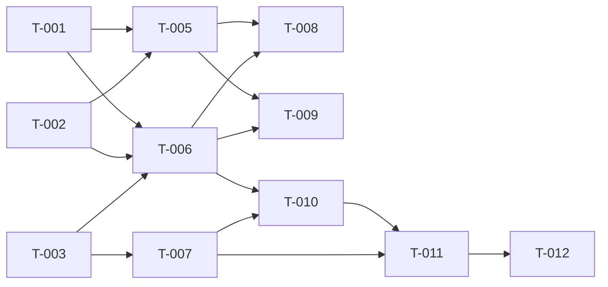

# Build Site — Codex Adversarial Review Integration

12 tasks across 5 tiers from 2 blueprints.

---

## Tier 0 — No Dependencies (Start Here)

| Task | Title | Blueprint | Requirement | Effort |
|------|-------|-----------|-------------|--------|
| T-001 | Codex binary detection utility | blueprint-codex-bridge.md | R1 | S |
| T-002 | Codex plugin presence check | blueprint-codex-bridge.md | R1 | S |
| T-003 | Configuration schema and defaults | blueprint-codex-bridge.md | R2 | M |
| T-004 | Gate configuration settings | blueprint-tier-gate.md | R3 | S |

---

## Tier 1 — Depends on Tier 0

| Task | Title | Blueprint | Requirement | blockedBy | Effort |
|------|-------|-----------|-------------|-----------|--------|
| T-005 | `codex_available` flag and one-time install nudge | blueprint-codex-bridge.md | R1 | T-001, T-002 | S |
| T-006 | Codex adversarial review invocation and finding parser | blueprint-codex-bridge.md | R3 | T-001, T-002, T-003 | L |
| T-007 | Finding format with codex source tag | blueprint-tier-gate.md | R4 | T-003 | M |

---

## Tier 2 — Depends on Tier 1

| Task | Title | Blueprint | Requirement | blockedBy | Effort |
|------|-------|-----------|-------------|-----------|--------|
| T-008 | Peer-review-loop replacement (Codex replaces MCP adversary) | blueprint-codex-bridge.md | R3 | T-005, T-006 | M |
| T-009 | `/bp:codex-review` standalone command | blueprint-codex-bridge.md | R4 | T-005, T-006 | M |
| T-010 | Tier boundary hook in build loop | blueprint-tier-gate.md | R1 | T-006, T-007 | M |

---

## Tier 3 — Depends on Tier 2

| Task | Title | Blueprint | Requirement | blockedBy | Effort |
|------|-------|-----------|-------------|-----------|--------|
| T-011 | Severity-based gating with fix-task generation | blueprint-tier-gate.md | R2 | T-010, T-007 | L |

---

## Tier 4 — Depends on Tier 3

| Task | Title | Blueprint | Requirement | blockedBy | Effort |
|------|-------|-----------|-------------|-----------|--------|
| T-012 | Review-fix cycle with re-review and max iterations | blueprint-tier-gate.md | R2 | T-011 | M |

---

## Dependency Graph

---

## Summary

| Tier | Tasks | Effort |
|------|-------|--------|
| 0 | 4 | 3S + 1M |
| 1 | 3 | 1S + 1L + 1M |
| 2 | 3 | 3M |
| 3 | 1 | 1L |
| 4 | 1 | 1M |

**Total: 12 tasks, 5 tiers**

---

## Architect Report

### Blueprints Read: 2
### Tasks Generated: 12
### Tiers: 5
### Tier 0 Tasks: 4 (can run in parallel immediately)

### Task-to-Requirement Coverage
| Blueprint | Requirement | Tasks |
|-----------|-------------|-------|
| codex-bridge | R1 (Detection) | T-001, T-002, T-005 |
| codex-bridge | R2 (Config) | T-003 |
| codex-bridge | R3 (Peer-Review Replacement) | T-006, T-008 |
| codex-bridge | R4 (Standalone Command) | T-009 |
| tier-gate | R1 (Tier Boundary Hook) | T-010 |
| tier-gate | R2 (Severity Gating) | T-011, T-012 |
| tier-gate | R3 (Gate Config) | T-004 |
| tier-gate | R4 (Finding Integration) | T-007 |

### Next Step
Run `/bp:build` to start implementation (auto-parallelizes independent tasks).
