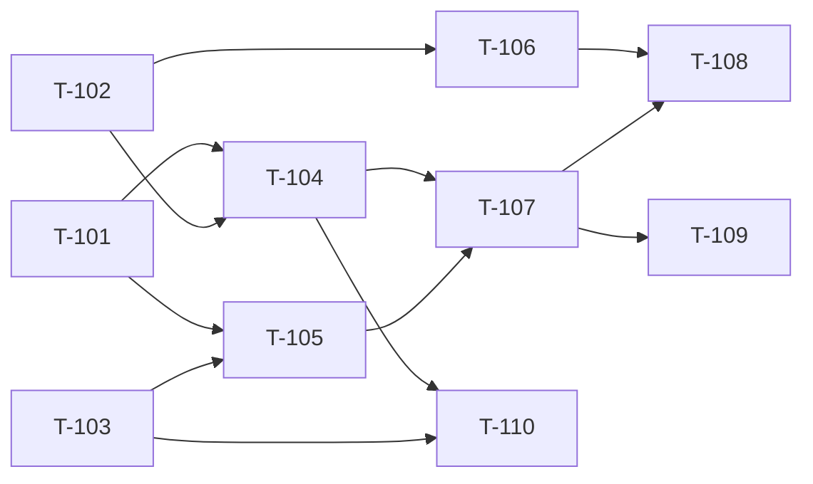

# Build Site — Command Safety Gate

10 tasks across 4 tiers from 1 blueprint (+ codex-bridge dependency).

---

## Tier 0 — No Dependencies (Start Here)

| Task | Title | Blueprint | Requirement | Effort |
|------|-------|-----------|-------------|--------|
| T-101 | PreToolUse hook scaffold (Bash matcher, approve/block/passthrough return) | blueprint-command-gate.md | R1 | M |
| T-102 | Built-in allowlist and blocklist with base-executable + flag classification | blueprint-command-gate.md | R2 | M |
| T-103 | Command gate configuration schema and defaults | blueprint-command-gate.md | R7 | S |

---

## Tier 1 — Depends on Tier 0

| Task | Title | Blueprint | Requirement | blockedBy | Effort |
|------|-------|-----------|-------------|-----------|--------|
| T-104 | Fast-path classifier (allowlist/blocklist lookup in hook) | blueprint-command-gate.md | R2 | T-101, T-102 | M |
| T-105 | Claude permission system integration (skip gate for pre-allowed/blocked) | blueprint-command-gate.md | R4 | T-101, T-103 | M |
| T-106 | Command normalizer (strip variable args, preserve structure + flags) | blueprint-command-gate.md | R5 | T-102 | M |

---

## Tier 2 — Depends on Tier 1

| Task | Title | Blueprint | Requirement | blockedBy | Effort |
|------|-------|-----------|-------------|-----------|--------|
| T-107 | Codex safety classification call (send command, parse structured verdict) | blueprint-command-gate.md | R3 | T-104, T-105 | L |
| T-108 | Pattern-based verdict cache (normalized key, session-scoped, in-memory) | blueprint-command-gate.md | R5 | T-106, T-107 | M |

---

## Tier 3 — Depends on Tier 2

| Task | Title | Blueprint | Requirement | blockedBy | Effort |
|------|-------|-----------|-------------|-----------|--------|
| T-109 | Graceful degradation (Codex unavailable fallback, timeout handling) | blueprint-command-gate.md | R6 | T-107 | M |
| T-110 | User-extensible allowlist/blocklist via config + session gate mode (all/interactive/off) | blueprint-command-gate.md | R2, R7 | T-104, T-103 | S |

---

## Dependency Graph

---

## Summary

| Tier | Tasks | Effort |
|------|-------|--------|
| 0 | 3 | 2M + 1S |
| 1 | 3 | 3M |
| 2 | 2 | 1L + 1M |
| 3 | 2 | 1M + 1S |

**Total: 10 tasks, 4 tiers**

---

## Cross-Site Dependency

This site depends on `build-site-codex.md` tasks T-001 and T-002 (Codex binary detection and plugin presence check). Those must be complete before T-107 can call Codex. If building both sites, execute `build-site-codex` Tier 0 first or in parallel with this site's Tier 0.

---

## Architect Report

### Blueprints Read: 1 (+ codex-bridge for detection)
### Tasks Generated: 10
### Tiers: 4
### Tier 0 Tasks: 3 (can run in parallel immediately)

### Task-to-Requirement Coverage
| Blueprint | Requirement | Tasks |
|-----------|-------------|-------|
| command-gate | R1 (PreToolUse Hook) | T-101 |
| command-gate | R2 (Fast-Path Classification) | T-102, T-104, T-110 |
| command-gate | R3 (Codex Safety Classification) | T-107 |
| command-gate | R4 (Claude Permission Integration) | T-105 |
| command-gate | R5 (Verdict Cache) | T-106, T-108 |
| command-gate | R6 (Graceful Degradation) | T-109 |
| command-gate | R7 (Configuration) | T-103, T-110 |

### Next Step
Run `/bp:build` to start implementation.
If building alongside the Codex review integration, run both sites — Tier 0 tasks are independent.
