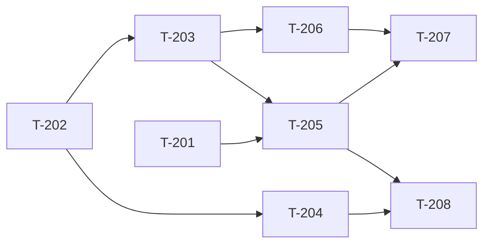

# Build Site — Speculative Pre-Build Review

8 tasks across 4 tiers from 1 blueprint (+ codex-bridge and tier-gate dependencies).

---

## Tier 0 — No Dependencies (Start Here)

| Task | Title | Blueprint | Requirement | Effort |
|------|-------|-----------|-------------|--------|
| T-201 | Speculative review configuration schema and defaults | blueprint-speculative-review.md | R5 | S |
| T-202 | Background job ID tracking data structure (session-scoped) | blueprint-speculative-review.md | R1 | S |

---

## Tier 1 — Depends on Tier 0

| Task | Title | Blueprint | Requirement | blockedBy | Effort |
|------|-------|-----------|-------------|-----------|--------|
| T-203 | Background Codex review dispatch at tier completion | blueprint-speculative-review.md | R1 | T-202 | M |
| T-204 | Pipeline overlap status reporting in build loop output | blueprint-speculative-review.md | R4 | T-202 | S |

---

## Tier 2 — Depends on Tier 1

| Task | Title | Blueprint | Requirement | blockedBy | Effort |
|------|-------|-----------|-------------|-----------|--------|
| T-205 | Result retrieval with timeout and synchronous fallback | blueprint-speculative-review.md | R2 | T-203, T-201 | M |
| T-206 | Finding reconciliation — merge speculative findings into tier gate flow | blueprint-speculative-review.md | R3 | T-203 | M |

---

## Tier 3 — Depends on Tier 2

| Task | Title | Blueprint | Requirement | blockedBy | Effort |
|------|-------|-----------|-------------|-----------|--------|
| T-207 | P0/P1 queuing — hold findings during active tier, process after completion | blueprint-speculative-review.md | R3 | T-206, T-205 | M |
| T-208 | Impl tracking integration — tier review source, time-saved metrics | blueprint-speculative-review.md | R4 | T-204, T-205 | S |

---

## Dependency Graph

---

## Summary

| Tier | Tasks | Effort |
|------|-------|--------|
| 0 | 2 | 2S |
| 1 | 2 | 1M + 1S |
| 2 | 2 | 2M |
| 3 | 2 | 1M + 1S |

**Total: 8 tasks, 4 tiers**

---

## Cross-Site Dependencies

Requires from `build-site-codex.md`:
- T-001, T-002 (Codex detection) — needed before T-203 can dispatch
- T-006 (Codex invocation + finding parser) — needed for T-203 and T-206
- Tier gate tasks T-010, T-011 — speculative review feeds into the same gating logic

**Build order:** Execute `build-site-codex` through at least Tier 1 before starting this site's Tier 1.

---

## Architect Report

### Blueprints Read: 1 (+ codex-bridge, tier-gate for shared infrastructure)
### Tasks Generated: 8
### Tiers: 4
### Tier 0 Tasks: 2 (can run in parallel immediately)

### Task-to-Requirement Coverage
| Blueprint | Requirement | Tasks |
|-----------|-------------|-------|
| speculative-review | R1 (Background Dispatch) | T-202, T-203 |
| speculative-review | R2 (Result Retrieval) | T-205 |
| speculative-review | R3 (Finding Reconciliation) | T-206, T-207 |
| speculative-review | R4 (Pipeline Overlap Tracking) | T-204, T-208 |
| speculative-review | R5 (Configuration) | T-201 |

### Next Step
Run `/bp:build` after `build-site-codex` Tier 1 is complete.
